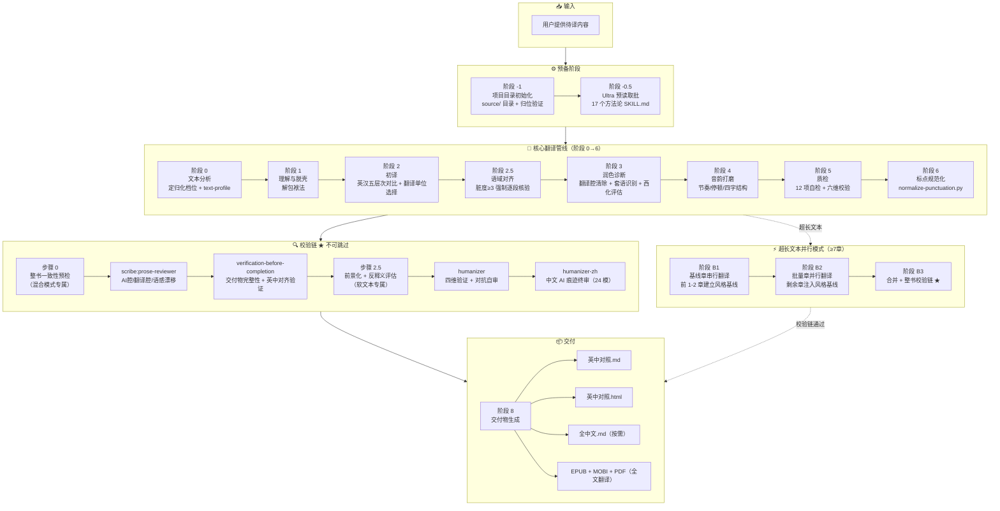

# en-zh-max 翻译工作流流程图

> 完整管线：从输入到交付，含校验链 ★ 不可跳过



## 阶段说明

| 阶段 | 名称 | 核心产出 | 准出条件 |
|------|------|---------|---------|
| **-2** | 预扫描与策略决定 | `translation-plan.md` | 总章数 + 词数统计，模式判定 |
| **-1** | 项目初始化 | `source/` 目录 + 归位验证 | 原始文件移入，提取产物生成 |
| **-0.5** | Ultra 预读取 ★ | 17 个方法论文件已读 | INDEX + 16 skill 全部 Read 完成 |
| **0** | 文本分析 | text-profile 写入头部 | 档位/自由度/文本类型/语域 四项非占位符 |
| **1** | 理解与脱壳 | 脱壳摘要注释 | 3-5 句中文概括，不含英文词 |
| **2** | 初译 | 英中对照初稿 | 每段标记 `[v1]` |
| **2.5** | 语域对齐 | 语域偏差修正 | 每段标注 R 状态（脏度≥3 时强制） |
| **3** | 润色诊断 | 翻译腔消除稿 | 每段标 `[v2·操作类型]` |
| **4** | 音韵打磨 | 节奏优化稿 | 每段标 `[v3]` |
| **5** | 质检 | 自检通过稿 | 每段标 `[v3·Q✓]` |
| **6** | 标点规范 | 标点标准化 | `normalize-punctuation.py` 残留 = 0 |
| **7** | 校验链 ★ | 四道审查全部通过 | see below ↓ |
| **8** | 交付 | .md + .html + 按需格式 | 五项清理验证全部通过 |

## 校验链详解 ★

```
阶段 6 通过
    ↓
步骤 0：整书一致性预检（混合模式）
    └── 术语一致性扫描 + 语感漂移检测 + 衔接质量抽查
    └── 纯串行模式跳过
    ↓
① scribe:prose-reviewer
    └── 整书级 AI 腔/翻译腔/语感漂移审查
    └── 未通过 → 标记问题段落，退回阶段 3
    ↓
② verification-before-completion
    └── 交付物完整性检查
    └── 英中对齐验证（每段英文有对应中文）
    └── 未通过 → 补全缺失部分
    ↓
步骤 2.5：前景化 + 反释义评估
    └── 软文本（自由度≥4）专属
    └── 硬文本跳过此步
    ↓
③ humanizer
    └── 四维验证：Fidelity / Naturalness / Grammar / AI Patterns
    └── 强制对抗自审，原位修复
    └── 混合模式分层执行（Tier 1-3）
    ↓
④ humanizer-zh
    └── 24 条中文 AI 痕迹规则（四大类 × 6）
    └── 仅扫中文译文，不动英文 blockquote
    ↓
阶段 8 — 交付物生成
```

## 方法论引用

本 skill 方法论基于叶子南《高级英汉翻译理论与实践》（清华大学出版社，2020），经 book2skill 蒸馏为 17 个 ultra 技能。详见 [`ultra/SKILL_MAP.md`](SKILL_MAP.md)。
